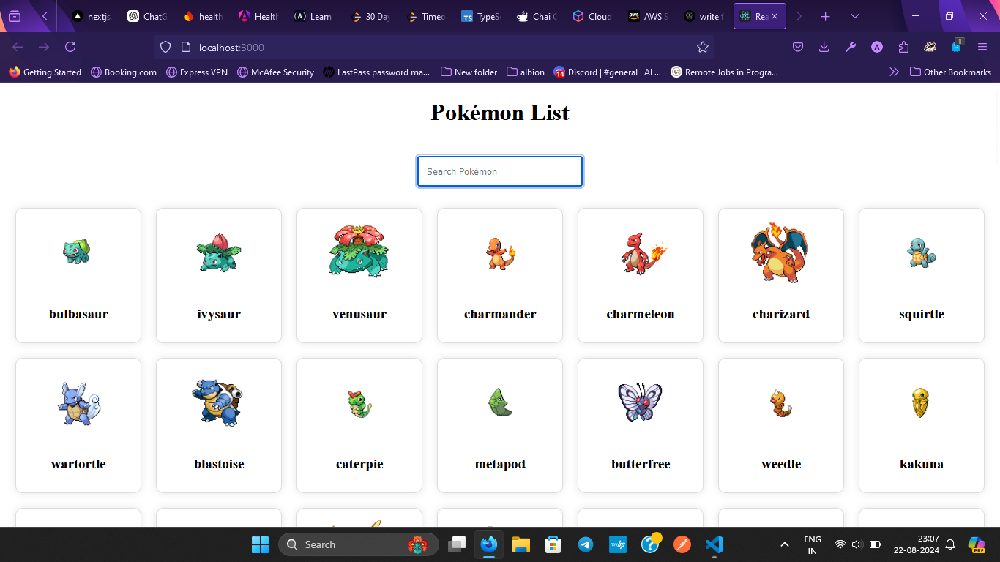
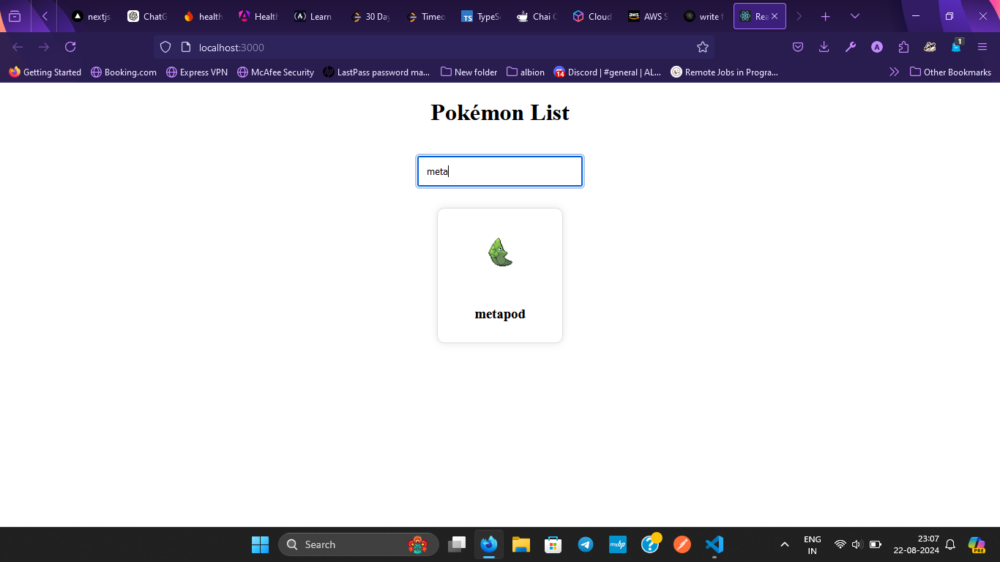

# Pokémon App

This is a simple React application that displays a list of Pokémon fetched from the [PokéAPI](https://pokeapi.co/api/v2/pokemon). The app allows users to search for Pokémon by name and displays the results in a card format with images.

## Features

- Fetches and displays a list of Pokémon from the PokéAPI.
- Displays each Pokémon in a card with its image and name.
- Includes a search bar to filter Pokémon by name in real-time.
- Responsive design for better user experience across devices.

## Installation

To run this project locally, follow these steps:

1. Clone the repository:

bash

git clone https://github.com/your-username/pokemon-app.git

2. Navigate to the project directory:

bash

cd pokemon-app

3. Install the dependencies:

bash

npm install

4. Start the development server:

bash

npm start

Result -

search feature-
